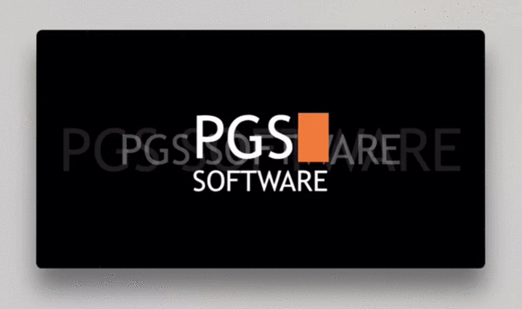
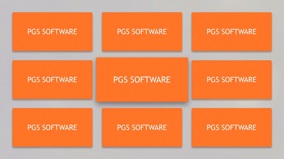

 

# ParallaxView

[](https://swift.org/)
[](https://cocoapods.org/pods/ParallaxView)
[](https://github.com/Carthage/Carthage)
[](http://cocoadocs.org/docsets/ParallaxView)
[](https://github.com/PGSSoft/ParallaxView/LICENSE.md)

## Summary

**Easy to use `UIView`, `UICollectionViewCell` with parallax effect and extensions to add this effect to any `UIView`. Rotate view using Apple TV remote. Works confusingly similar to tiles in the home screen of the Apple TV.**




### ParallaxView

Open your storyboard or xib and drag and drop `UIView` control.
Change custom class to `ParallaxView` in *Identity inspector*.
You can also create control from code.

### ParallaxCollectionViewCell

In *Interface builder* change collection view cell class to `ParallaxCollectionViewCell` or do it from code.

You can also create subclass of `ParallaxCollectionViewCell` insted of `UICollectionViewCell` and use it as normal collection view cell.

### Extension

If `ParallaxView` and `ParallaxCollectionViewCell` don't fit to your needs you can use extension that can be used with any `UIView`. In many cases it can look like in this example:

```swift
override func didUpdateFocus(in context: UIFocusUpdateContext, with coordinator: UIFocusAnimationCoordinator) {
	coordinator.addCoordinatedAnimations({
		if context.nextFocusedView === yourCustomView {
			yourCustomView.addParallaxMotionEffects()
		}
		if context.previouslyFocusedView === yourCustomView {
			yourCustomView.removeParallaxMotionEffects()
		}
	}, completion: nil)
}
```

It is important to add and remove parallax effect inside the animation block to avoid the glitches.
`ParallaxView` and `ParallaxCollectionViewCell` internally use the same methods.
For more details look into example.

## Customisation

The component is documented in code, also look into example for more details.

### Properties

`ParallaxView` and `ParallaxCollectionViewCell` have the same properties for customisation.

* `parallaxEffectOptions` - using this property you can customize parallax effect.
	* `parallaxMotionEffect` - configure parallax effect (pan, angles, etc.)
	* `subviewsParallaxMode` - enum that allow you to configure parallax effect for subviews of the `ParallaxView`
	* `shadowPanDeviation` - maximal value of points that shadow of the `ParallaxView` will be moved during parallax effect
	* `glowAlpha` - configure alpha of the glow effect (if is equal to 0.0 then the glow effect will be not added)
	* `parallaxSubviewsContainer` - custom container view that will be usead to apply subviews parallax effect. By default it will be parallaxable view by itself.
	* `glowContainerView` - view that will be used as the container for the glow effect. You don't have to configure this because for `ParallaxView` it will be automatically created a subview for this purpose, while for `ParallaxCollectionViewCell` it will be used `contentView` of the cell. Also by default it is nil when you use extension (`self` will be used as the glow container but only if `glowAlpha` is bigger than 0.0). But if you want to, you can define custom view - look into example project for more details.
	* `glowImageView` - image view that will be used as the glow effect. `ParallaxView` framework provides default image that will be set.

* `parallaxViewActions` - use properties of this property to change default behaviours of the parallax view. Internally both `ParallaxView` and `ParallaxCollectionViewCell` calls callbacks.
	* `setupUnfocusedState ` - closure will be called in animation block when view should change its appearance to the focused state
	* `setupFocusedState` - closure will be called in animation block when view should change its appearance to the unfocused state
	* `beforeBecomeFocusedAnimation` - closure will be called before the animation to the focused change start
	* `beforeResignFocusAnimation` - closure will be called before the animation to the unfocused change start
	* `becomeFocused ` - closure will be called when didFocusChange happened. In most cases default implementation should work
   * `resignFocus ` - closure will be called when didFocusChange happened. In most cases default implementation should work.
	* `animatePressIn` - default implementation of the press begin animation
	* `animatePressOut` - default implementation of the press ended animation
* `cornerRadius` - use this value insted of `self.view.layer.cornerRadius`. This will automatically correct radius for glow effect view if it is necessary

## Requirements

Swift 3.0, tvOS 9.0

## Installation

The most convenient way to install it is by using [Cocoapods](https://cocoapods.org/) with Podfile:

```ruby
pod 'ParallaxView'
```

or using [Carthage](https://github.com/Carthage/Carthage) and add a line to `Cartfile`:

```
github "PGSSoft/ParallaxView"
```

## Usage

```swift
import ParallaxView
```

#### Manual

You can download the latest files from our [Releases page](https://github.com/PGSSoft/ParallaxView/releases). After doing so, drag `ParallaxView.xcodeproj` into your project in Xcode, and for your project target on ***General*** tab in ***Embedded Binaries*** section add `ParallaxView.framework`. Example project is configured the same way, so you have the crib sheet.


## Contributing

Bug reports and pull requests are welcome on GitHub at [https://github.com/PGSSoft/ParallaxView](https://github.com/PGSSoft/ParallaxView).

## License

The project is available as open source under the terms of the [MIT License](http://opensource.org/licenses/MIT).

## About

The project maintained by [software development agency](https://www.pgs-soft.com/) [PGS Software](https://www.pgs-soft.com/).
See our other [open-source projects](https://github.com/PGSSoft) or [contact us](https://www.pgs-soft.com/contact-us/) to develop your product.

## Follow us

[](https://twitter.com/intent/tweet?text=https://github.com/PGSSoft/InAppPurchaseButton)  
[](https://twitter.com/pgssoftware)